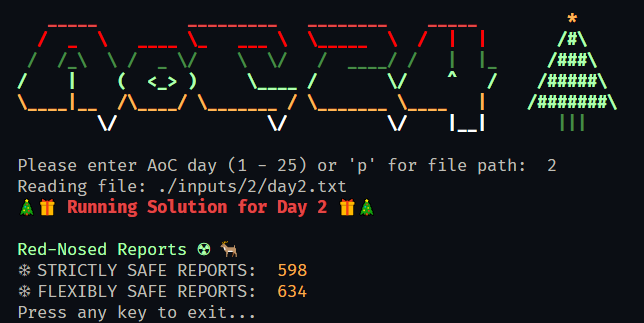

<h1 align="center">🎀 Advent of Code 2024 Typescript Solutions 🎁</h1>

<p align="center">
  
</p>

<h3 align="center">Running:</h3>

<p align="center">
  <code>deno run --allow-read ./main.ts</code>
  <br>
  or
  <br>
  <code>deno run --allow-read ./main.ts &lt;Optional day input file path&gt;</code>
</p>

<p align="center">👇</p>

<p align="center">
  
</p>

<h3 align="center">Inputs:</h3>

<p align="center">
Structure your puzzle inputs like this and they will work with the cli.
</p>

```
📂inputs
 ┣ 📂1
 ┃ ┗ 📜day1.txt
 ┣ 📂2
 ┃ ┗ 📜day2.txt
 ┣ 📂3
 ┃ ┗ 📜day3.txt
 .
```

<h3 align="center">Citations:</h3>

<p align="center">
  I like to use <a href="https://www.conventionalcommits.org/en/v1.0.0/">Conventional Commits</a>.
</p>

<p align="center">
  <a href="https://deno.land/">
    
  </a>
  &nbsp;&nbsp;&nbsp;&nbsp;
  <a href="https://www.typescriptlang.org/">
    
  </a>
</p>

# 

<p align="center">
  
</p>
